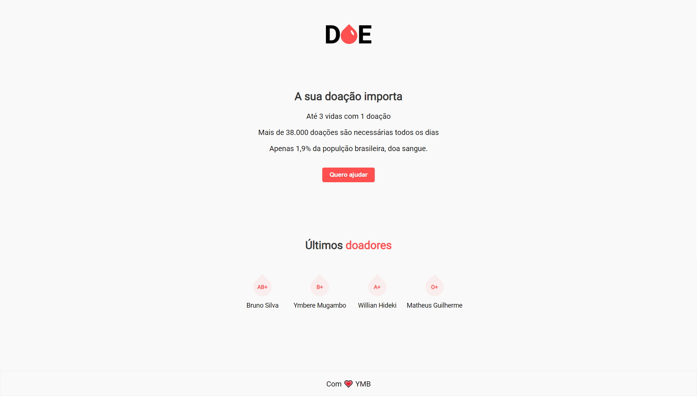

# DOE 
> Template para um site de doação de sangue

![NPM Version][npm-image]


O intuito desse template é ser de facil utilização por qualquer tipo de usuário, visualmente agradável e dinâmico. 



## Configuração para Desenvolvimento

Este projeto não possui muitas dependencias, e para realizar a instalação das que são necessarias, basta realizar o processo abaixo.

```sh
npm install
```

## Meta

Matheus Guilherme – matheusguilherme51@hotmail.com

Distribuído sob a licença MIT. Veja `LICENSE` para mais informações.

[Github](https://github.com/Matheus-Guilherme)

## Contributing

1. [MaratonaDev](https://rocketseat.com.br) por RocketSeat 

[npm-image]: https://img.shields.io/npm/v/datadog-metrics.svg?style=flat-square
